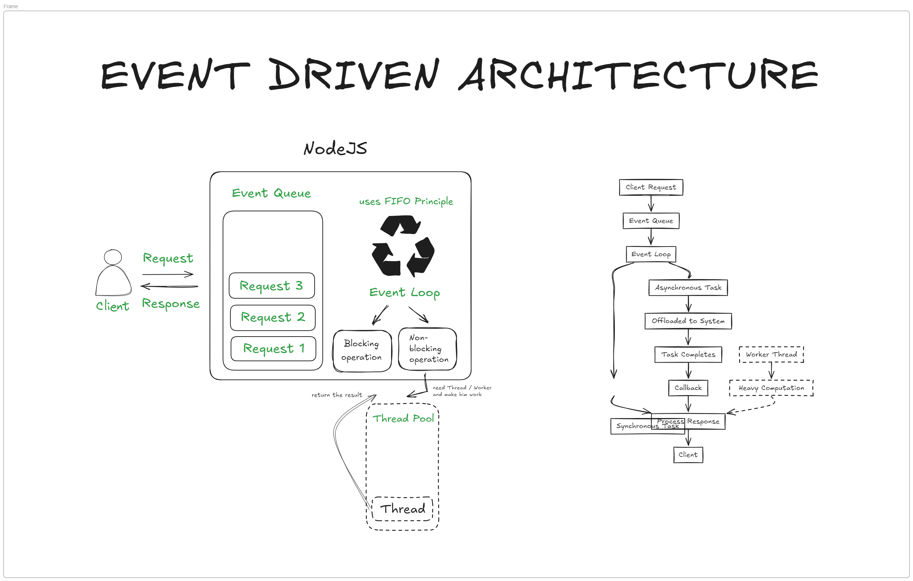

# How Node.js Works

Node.js is a JavaScript runtime built on Chrome's V8 JavaScript engine. It allows developers to run JavaScript code outside the browser, typically for backend development. Here's an overview of how Node.js works:

## 1. Single-Threaded Event Loop

Node.js operates on a **single-threaded event loop**, which allows it to handle multiple requests concurrently without creating a new thread for each request. 

- **Event Loop:** The event loop is the core part of Node.js. It listens for events (such as HTTP requests) and triggers callback functions when these events occur.
- **Non-Blocking I/O:** Node.js uses non-blocking I/O operations, meaning it doesn't wait for tasks like reading from a file or accessing a database. Instead, it registers callbacks and moves on to other tasks until the data is ready.

## 2. Non-Blocking Asynchronous Model

In traditional server environments, each request is handled sequentially, often blocking the entire server until a response is ready. With Node.js:

- Operations such as reading files, querying a database, or handling HTTP requests are asynchronous.
- Node.js doesn't block the main thread while waiting for these operations to finish. It moves on to the next task and processes the results via callbacks or promises once the task is completed.

## 3. Event-Driven Architecture

Node.js is **event-driven**, meaning that it uses events to trigger actions. This is a core feature of its non-blocking, asynchronous model, allowing Node.js to efficiently handle many simultaneous connections.

- **Event Listeners:** An event listener is a function that waits for an event to occur. When a specific event (like a user request) happens, the listener executes its corresponding callback function.
- **Callback Functions:** These are functions that are passed as arguments to other functions (like event listeners). They are executed once an event is triggered or when an asynchronous task completes.

### How the Event-Driven Model Works:

1. **Events and Event Emitters:**
   - In Node.js, events are often emitted by objects called **Event Emitters**. These emitters trigger events that the event loop listens to.
   - For example, in an HTTP server, an `http` module’s server object emits an event whenever a client sends a request. The event loop catches this event and processes it by calling the appropriate callback function.

2. **Callback Queue:**
   - When events are triggered, Node.js places the associated callback functions in the **callback queue**.
   - The event loop continuously checks the callback queue for functions that are ready to be executed, ensuring that non-blocking asynchronous tasks don't interfere with other operations.

3. **Asynchronous Event Handling:**
   - In an event-driven architecture, tasks such as handling I/O operations, network requests, or file reading are executed asynchronously.
   - When these operations are completed, an event is emitted, and the corresponding callback is executed.

4. **Example of Event-Driven Workflow:**
   - An HTTP request is sent to the Node.js server.
   - The server emits an event like `request`.
   - Node.js processes the event using a callback that handles the incoming request.
   - Once the request is processed (e.g., querying a database or reading a file), Node.js emits another event that triggers a callback to send the response back to the client.

## 4. V8 Engine

Node.js uses Google Chrome's **V8 JavaScript engine**, which is highly optimized for fast execution of JavaScript code. 

- The V8 engine compiles JavaScript code into machine code directly, which allows for high-performance execution.
- It handles JavaScript execution and memory management efficiently, which is why Node.js can handle a large number of concurrent requests.

## 5. Built-in Modules

Node.js comes with several built-in modules that allow developers to perform common tasks without relying on external libraries. Some important modules include:

- **HTTP Module**: Used to create web servers and handle HTTP requests.
- **File System Module (fs)**: Allows interaction with the file system, such as reading and writing files.
- **Path Module**: Helps in handling and manipulating file and directory paths.
- **Event Module**: Used for working with event-driven programming.

## 6. npm (Node Package Manager)

**npm** is a package manager for Node.js. It allows developers to easily install and manage libraries and frameworks. npm provides access to thousands of open-source packages that can be added to Node.js applications.

- **Packages**: These are reusable code modules (e.g., libraries, frameworks) that are shared within the Node.js community.
- **Dependencies**: Packages can be installed as dependencies to enhance the functionality of a Node.js application.

## 7. How Node.js Works

Node.js works in an asynchronous, event-driven model that allows it to handle many requests efficiently without blocking the server.

1. **Single-Threaded Event Loop:**
   - Node.js operates on a **single thread**, but it can handle multiple requests through asynchronous callbacks and events.
   - When a request comes in, Node.js doesn't wait for it to be fully processed. Instead, it adds the request to the event queue and moves on to the next operation.
   - The event loop continuously checks the event queue and processes events as soon as they are ready, allowing it to handle multiple requests simultaneously without creating multiple threads.

2. **Non-Blocking I/O:**
   - Node.js delegates I/O tasks (like reading from files, database queries, or API requests) to the underlying system, which can handle them in parallel.
   - Node.js doesn’t block the execution while waiting for these operations to finish, allowing the main thread to stay free to handle other requests.

3. **Callbacks and Promises:**
   - When the I/O operation completes, Node.js processes the callback functions, which allow the results of those operations to be returned to the application without blocking.
   - Promises and async/await syntax in JavaScript also help to handle asynchronous operations in a more readable way.

4. **Handling Requests:**
   - When a request is received (like a user making a request to a server), the event loop triggers the associated callback function.
   - If the request involves I/O, Node.js executes the operation asynchronously, and once the I/O operation is completed, the callback function is invoked to return the result.

## 8. Node.js Applications Flow

1. **Application Request:** A client sends an HTTP request to the Node.js server.
2. **Event Loop:** The event loop listens for the request, and Node.js processes it asynchronously.
3. **I/O Operation:** If the request involves I/O operations, Node.js performs these in a non-blocking manner.
4. **Response:** Once the data is available, Node.js sends the response to the client.

## Conclusion

Node.js is highly efficient for I/O-intensive operations due to its event-driven, non-blocking, asynchronous nature. Its single-threaded model and V8 engine allow it to handle a large number of concurrent requests with minimal overhead. This makes Node.js a great choice for building scalable and high-performance applications like web servers and APIs.
